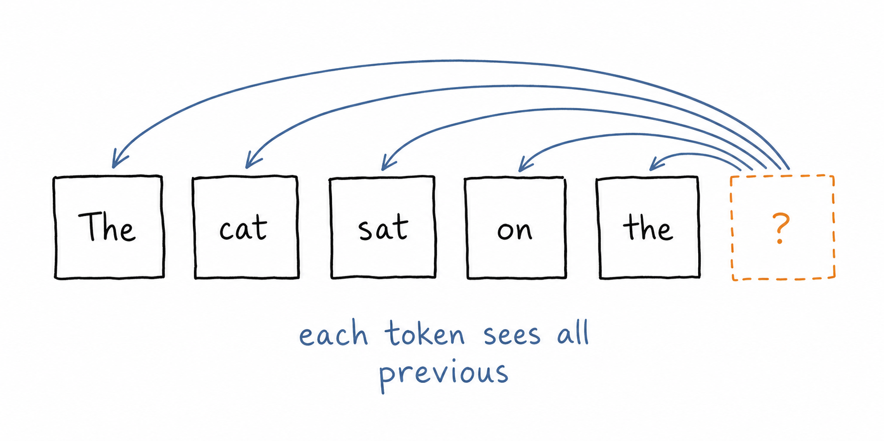
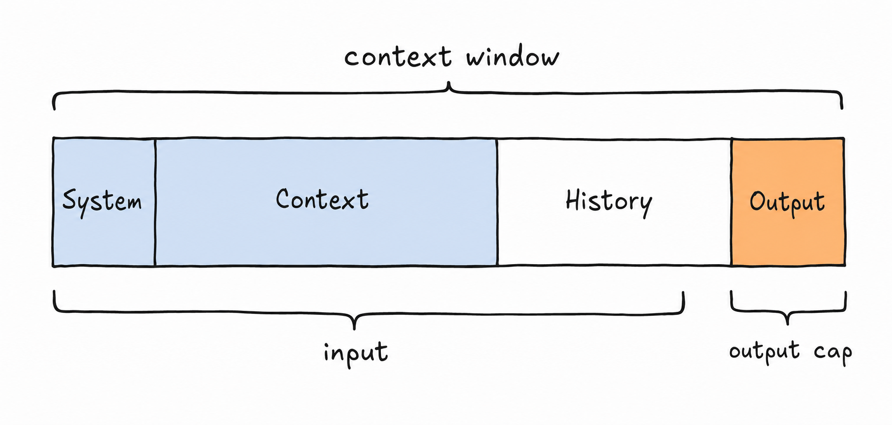
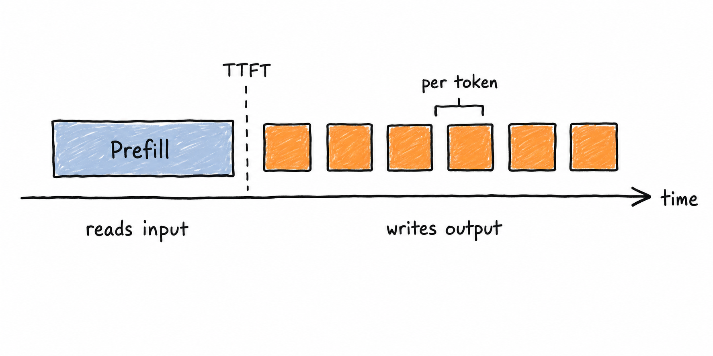

# 01 · LLM Fundamentals

> What the model is actually doing, why it fails the way it does, and how to choose one on evidence instead of vibes.

## Why This Matters

Almost every production LLM bug traces back to a fundamentals gap. Truncated output? Output-token limit, not context window. Non-deterministic results at `temperature=0`? Batching and floating-point nondeterminism, not a bug in your code. Costs 4× the estimate? You priced input tokens and forgot output tokens are 3–5× more expensive. Model can't count the letters in a word? Tokenization, not stupidity. You don't need to train a model, but you need an accurate mental model of tokens in → tokens out, what that costs in money and milliseconds, and where the architecture makes certain failures inevitable.

---

## Key Subtopics

### 1.1 Transformers and the attention mechanism

A decoder-only transformer predicts the next token by letting each position attend to all previous positions. Stack that ~30–100 times with feed-forward layers in between and you get an LLM. Attention itself is three projections of each token — **query**, **key**, **value**. Every position's query is scored against every previous key; those scores become weights over the values. "Multi-head" means doing this in parallel subspaces so different heads can track different relationships.

The parts worth internalizing: attention is *quadratic* in sequence length (why long context is expensive), the model is *stateless* between calls (why you resend the whole conversation every turn), and generation is *autoregressive* (why output tokens cost more latency than input tokens).

**Attention variants** you'll see named in model cards, all trading quality for KV-cache memory: **MHA** (every head has its own keys/values), **MQA** (all heads share one key/value set — much smaller cache, some quality loss), **GQA** (groups of heads share — the common middle ground today). This is why two models with the same parameter count can have very different memory footprints at long context.

- [Attention Is All You Need](https://arxiv.org/abs/1706.03762) — the original paper; skim §3
- [The Illustrated Transformer](https://jalammar.github.io/illustrated-transformer/) — read this first if the paper is opaque
- [Karpathy: Let's build GPT from scratch](https://www.youtube.com/watch?v=kCc8FmEb1nY) — 2 hours, the single highest-leverage resource here
- [GQA: Training Generalized Multi-Query Transformer Models](https://arxiv.org/abs/2305.13245)

### 1.2 Tokenization and the context window

Models see tokens, not characters or words. Byte-pair encoding merges frequent character sequences, so English prose runs ~4 chars/token while code, JSON, non-Latin scripts, and long numbers are far less efficient — the same content can cost 2–3× more tokens in Hindi or Thai than in English, which is a real fairness and cost issue.

Three separate limits matter and get conflated constantly: **context window** (input + output combined), **max output tokens** (usually much smaller), and **effective** context — the point past which recall degrades even though the model technically accepts more.

**Tokenization explains a whole family of "dumb" failures.** The model can't reliably count the r's in "strawberry" because it never sees letters. Arithmetic is unreliable partly because numbers tokenize inconsistently. Reversing a string is hard for the same reason. These aren't reasoning failures — they're representation failures, and no prompt fixes them. Use a tool instead.

- [Neural Machine Translation of Rare Words with Subword Units](https://arxiv.org/abs/1508.07909) — BPE, the source
- [Tiktokenizer](https://tiktokenizer.vercel.app/) — paste text, see the tokens; do this before estimating any cost
- [Karpathy: Let's build the GPT Tokenizer](https://www.youtube.com/watch?v=zduSFxRajkE) — why tokenization causes so many weird bugs
- [Lost in the Middle](https://arxiv.org/abs/2307.03172) — retrieval accuracy degrades for content buried mid-context

### 1.3 Embeddings and positional encoding

Each token ID is looked up in an embedding matrix to become a vector of a few thousand dimensions. Those vectors are the model's actual input, and their geometry carries meaning — similar tokens land near each other, and directions in the space correspond to relationships. This is the same idea you'll use deliberately for retrieval in [Module 03](../03-retrieval-and-rag/README.md), except there you embed whole passages rather than single tokens.

Attention is order-blind on its own — it sees a *set* of vectors, not a sequence. **Positional encoding** injects order. Original transformers added fixed sinusoidal vectors; nearly every modern model uses **RoPE** (rotary position embeddings), which rotates query and key vectors by an angle proportional to position, so attention scores depend on *relative* distance.

Why you should care in practice: RoPE is what makes **context extension** possible. Techniques that stretch a model trained at 8K to run at 128K work by interpolating or rescaling those rotations. That's also why a model's "extended" context often performs worse than its native range — the positions it's being asked about are outside what it saw in training.

- [RoFormer: Rotary Position Embedding](https://arxiv.org/abs/2104.09864)
- [YaRN: Efficient Context Window Extension](https://arxiv.org/abs/2309.00071)
- [The Illustrated Word2vec](https://jalammar.github.io/illustrated-word2vec/) — the clearest intuition for what a vector space of meaning is

### 1.4 Architecture variants: dense, MoE, and multimodal

**Encoder-only** (BERT-family) produces representations, not text — still the right tool for classification and embeddings. **Encoder-decoder** (T5) suits translation-shaped tasks. **Decoder-only** won for general-purpose generation and is what "LLM" now means by default.

**Mixture of Experts (MoE)** is the biggest architectural shift in recent frontier models. Instead of one big feed-forward block per layer, there are many "expert" blocks and a router that activates only a few per token. A model can have 400B total parameters but activate only 30B per token — so it has the knowledge capacity of a huge model at the inference cost of a much smaller one. This is why parameter counts have stopped being a useful comparison: **total parameters** determine memory, **active parameters** determine speed and cost.

**Multimodal** models turn images (and audio) into tokens too — a vision encoder converts an image into a sequence of patch embeddings that get fed alongside text tokens. That's why images consume context budget, often 1,000+ tokens for a high-resolution image, and why image-heavy prompts get expensive quickly.

- [Switch Transformers](https://arxiv.org/abs/2101.03961) and [Mixtral of Experts](https://arxiv.org/abs/2401.04088) — MoE in theory and practice
- [An Image is Worth 16x16 Words](https://arxiv.org/abs/2010.11929) — ViT, how images become tokens
- [Anthropic: Vision](https://docs.claude.com/en/docs/build-with-claude/vision) — practical token costs for images

### 1.5 The training lifecycle: pretraining → SFT → preference tuning

**Pretraining** on trillions of tokens produces a next-token predictor with broad knowledge and no manners. This is where ~99% of the compute goes, where the knowledge cutoff comes from, and where data quality dominates outcomes.

**Supervised fine-tuning (SFT)** on instruction/response pairs teaches it to follow instructions rather than continue text.

**Preference tuning** (RLHF, DPO, or variants) optimizes against human ratings for helpfulness and harmlessness. This explains the model's personality: it's optimized for *rated-as-good* responses, which is why it's agreeable, why it hedges, why it over-formats, and why it will produce a confident plausible answer rather than say "I don't know" — annotators rarely rate refusals highly.

Two more stages worth knowing: **distillation**, where a large model generates training data for a small one (the main reason small models got so good — see [Module 07](../07-emerging-topics/README.md#75-small-models-distillation-and-on-device)), and **RL on verifiable rewards**, where models are trained on problems with checkable answers (math, code) to produce long reasoning chains. That last one is how reasoning models are made.

- [Training language models to follow instructions with human feedback](https://arxiv.org/abs/2203.02155) — InstructGPT; the RLHF blueprint
- [Direct Preference Optimization](https://arxiv.org/abs/2305.18290) — the simpler alternative much of the field moved to
- [Constitutional AI](https://arxiv.org/abs/2212.08073) — AI feedback instead of human labels for harmlessness
- [DeepSeek-R1](https://arxiv.org/abs/2501.12948) — open recipe for RL-trained reasoning

### 1.6 Inference and decoding: sampling params, KV cache, streaming

At each step the model outputs a **logit** per vocabulary token; softmax turns those into probabilities. Decoding parameters shape how you sample:

| Parameter | Effect | Guidance |
|---|---|---|
| `temperature` | Flattens (>1) or sharpens (<1) the distribution | Tune this **or** `top_p`, not both |
| `top_p` | Truncates to the smallest set summing to *p* | 0.9–1.0 typical |
| `top_k` | Truncates to the *k* most likely tokens | Rarely needed alongside `top_p` |
| `frequency` / `presence` penalty | Discourages repetition | Blunt; prefer prompt fixes |
| `stop` sequences | Ends generation early | Cheapest latency win available |
| `max_tokens` | Hard output cap | Always set it |
| `seed` | Best-effort reproducibility | Not a guarantee |

**Logprobs** are underused: many APIs will return the log-probability of chosen tokens, which gives you a cheap confidence signal for routing, abstention, and flagging low-certainty extractions.

The **KV cache** stores attention keys/values for tokens already processed so each new token is O(1) rather than O(n). It's why prompt caching works, and why long conversations consume GPU memory linearly.

Latency decomposes into **TTFT** (time to first token, dominated by input length and prefill compute) and **TPOT/ITL** (per-output-token time, dominated by memory bandwidth). Streaming doesn't make generation faster; it makes TTFT the number the user feels.

- [How to generate text](https://huggingface.co/blog/how-to-generate) — greedy, beam, top-k, top-p, side by side
- [Efficient Memory Management for LLM Serving with PagedAttention](https://arxiv.org/abs/2309.06180) — the vLLM paper
- [Anthropic: Prompt caching](https://docs.claude.com/en/docs/build-with-claude/prompt-caching) — the practical payoff of a reusable prefix

### 1.7 Why models hallucinate

Not a bug to be patched — a consequence of the objective. The model is trained to produce *likely* continuations, not *true* ones. It has no separate store of facts to check against and no mechanism that distinguishes "I retrieved this" from "this is a fluent guess." Training compounds it: preference tuning rewards confident, helpful-sounding answers, and an admission of ignorance rarely wins a head-to-head comparison against a plausible answer.

Where hallucination concentrates: rare facts poorly represented in training data, anything after the knowledge cutoff, precise numbers and citations, chained multi-step reasoning where one wrong step propagates, and any question whose premise is false (models tend to accept the premise).

What actually helps, in order of effect: **give it the information** ([retrieval](../03-retrieval-and-rag/README.md)) so it doesn't have to recall; **make abstention available and legitimate** (an explicit `"insufficient_evidence"` option in your schema); **require citations** you can verify programmatically; **check the output** with a second call or a deterministic validator; and **measure it** ([evals](../05-evaluation-and-observability/README.md)) so you know your actual rate rather than guessing.

What doesn't help: telling the model "do not hallucinate."

- [Survey of Hallucination in Large Language Models](https://arxiv.org/abs/2311.05232)
- [Language Models (Mostly) Know What They Know](https://arxiv.org/abs/2207.05221) — on calibration and self-knowledge
- [TruthfulQA](https://arxiv.org/abs/2109.07958) — how models learn to repeat plausible falsehoods

### 1.8 What LLMs are structurally bad at

Knowing the failure surface is what stops you from designing a system that can't work:

- **Character-level operations** — counting letters, reversing strings, precise spelling. Tokenization hides characters.
- **Exact arithmetic** — fine at small numbers, unreliable at large ones. Use a calculator tool.
- **Counting and precise aggregation** over long lists. Use code.
- **Knowing what they don't know** — calibration is imperfect and degrades after fine-tuning.
- **Knowing anything after the cutoff** — including their own version and current model prices.
- **Self-report about their own internals** — an explanation of "why I answered that" is generated text, not introspection.
- **Long-horizon consistency** — contradicting themselves across a long conversation.
- **True randomness** — ask for a random number and you'll get 7 far too often.
- **Negation and constraint counting** — "exactly three, not four" is surprisingly unreliable.

The engineering response is always the same: move the thing the model is bad at *out of the model*, into a tool, a validator, or retrieved context.

**The counterweight:** in-context learning is genuinely remarkable — the model adapts to a task from examples in the prompt, with no weight updates. That's what makes few-shot prompting work ([Module 02](../02-prompting-and-context-engineering/README.md)).

- [GPT-3: Language Models are Few-Shot Learners](https://arxiv.org/abs/2005.14165) — where in-context learning was demonstrated at scale
- [Are Emergent Abilities of LLMs a Mirage?](https://arxiv.org/abs/2304.15004) — a useful corrective on capability claims

### 1.9 Precision, quantization, and model size

Parameters are stored as numbers, and the format determines memory. Rough rule for weights alone:

| Precision | Bytes/param | 8B model | 70B model |
|---|---|---|---|
| FP32 | 4 | ~32 GB | ~280 GB |
| BF16 / FP16 | 2 | ~16 GB | ~140 GB |
| FP8 | 1 | ~8 GB | ~70 GB |
| INT4 | 0.5 | ~4 GB | ~35 GB |

Add KV cache on top, which grows with context length and concurrency and often dominates at long context.

**Quantization** reduces precision after training. The practical finding: 8-bit is usually near-lossless, 4-bit is often acceptable, below that degrades noticeably — and degradation shows up first in long-context reasoning and rare knowledge, not in short benchmark questions. Always re-run your evals after quantizing; don't trust a general claim about "minimal quality loss."

This is the fundamental behind the serving decisions in [Module 06](../06-deployment-and-ai-infra/README.md#61-serving-and-inference-optimization).

- [LLM.int8()](https://arxiv.org/abs/2208.07339) · [GPTQ](https://arxiv.org/abs/2210.17323) · [AWQ](https://arxiv.org/abs/2306.00978)
- [Hugging Face: Quantization overview](https://huggingface.co/docs/transformers/main/en/quantization/overview)

### 1.10 Model selection, scaling laws, and reasoning models

Scaling laws describe how loss falls with compute, parameters, and data — Chinchilla corrected the field toward more data per parameter, and post-2024 the frontier moved again toward spending compute at *inference* time.

**Reasoning models** generate hidden intermediate tokens before answering, trading latency and cost for accuracy on multi-step problems. They are not a default upgrade: for extraction, classification, routing, and formatting, a fast non-reasoning model is usually better and 10× cheaper.

Choose per task, on your own eval set, measuring quality *and* cost *and* p95 latency. A mature system routes across a portfolio of models rather than standardizing on one.

- [Scaling Laws for Neural Language Models](https://arxiv.org/abs/2001.08361) and [Training Compute-Optimal LLMs](https://arxiv.org/abs/2203.15556) (Chinchilla)
- [Scaling LLM Test-Time Compute Optimally](https://arxiv.org/abs/2408.03314) — why thinking longer beats being bigger, sometimes
- [LMArena](https://lmarena.ai/) — useful for a rough prior, useless as a substitute for your own evals

---

## Tools & Frameworks Used in Industry

| Purpose | Tools |
|---|---|
| Frontier model APIs | Anthropic Claude, OpenAI, Google Gemini |
| Cloud-hosted access | Amazon Bedrock, Google Vertex AI, Azure AI Foundry |
| Multi-provider routing | [LiteLLM](https://docs.litellm.ai/), [OpenRouter](https://openrouter.ai/) |
| Local / open-weights | [Ollama](https://ollama.com/), [llama.cpp](https://github.com/ggml-org/llama.cpp), [LM Studio](https://lmstudio.ai/), [MLX](https://ml-explore.github.io/mlx/) |
| Model hub & libraries | [Hugging Face Hub](https://huggingface.co/models), `transformers`, `tokenizers` |
| Tokenizers | `tiktoken` (OpenAI), HF `tokenizers`, provider token-count endpoints |
| Learning by building | [nanoGPT](https://github.com/karpathy/nanoGPT), [minGPT](https://github.com/karpathy/minGPT) |
| Inspecting internals | [TransformerLens](https://transformerlensorg.github.io/TransformerLens/), [Neuronpedia](https://www.neuronpedia.org/) |

---

## Hands-On Project: Model Bake-Off Harness

**Build a CLI that answers "which model should we use for this task?" with a table instead of an opinion.**

Requirements:
1. Define one narrow task with 25–50 inputs and known-good outputs (e.g. extract `{company, amount, due_date}` from invoice text).
2. Run the task across ≥4 models spanning tiers — one frontier, one mid, one small/fast, one open-weights via Ollama.
3. For each run record: exact-match or field-level accuracy, input tokens, output tokens, **computed USD cost**, TTFT, and total latency.
4. Print a markdown table sorted by cost-per-correct-answer, and report p50/p95 latency, not the mean.
5. Sweep `temperature` ∈ {0, 0.7} and show the variance across 3 repeated runs at each setting.

**Done when:** you can point at the table and defend a model choice on cost-per-correct-answer, and you can explain why the cheapest model isn't always the winner.

**Stretch:**
- Add a reasoning model with a thinking budget and show where the extra tokens do and don't buy accuracy.
- Capture logprobs and check whether low confidence predicts wrong answers on your task — if it does, you have a free routing signal.
- Run the same open-weights model at BF16 and INT4 and measure what quantization actually costs you.

---

## Common Pitfalls

- **Estimating cost from characters.** Always tokenize. Code and JSON run ~2–3 chars/token; some non-English text is far worse.
- **Pricing only input tokens.** Output is typically 3–5× the input rate, and reasoning tokens are billed as output even when hidden.
- **Confusing context window with max output.** A 200K-context model may cap output at a small fraction of that. Truncated JSON is almost always this.
- **Expecting determinism at `temperature=0`.** Greedy decoding is not bit-reproducible across batching and hardware. Design for it; don't assert exact string equality in tests.
- **Tuning `temperature` and `top_p` together.** Pick one. Changing both makes results uninterpretable.
- **Comparing models by total parameter count.** With MoE, active parameters drive cost and speed; total parameters drive memory.
- **Assuming a bigger model is better for your task.** On narrow, well-specified tasks small models frequently tie frontier models at a fraction of the cost.
- **Trusting public leaderboards as production signal.** They're a prior for which models to *test*, not evidence about your data.
- **Ignoring that the API is stateless.** Every turn resends the full history — that's why conversation cost grows quadratically without compaction.
- **Asking the model to do character or arithmetic work.** Tokenization makes it structurally unreliable. Give it a tool.
- **Believing the model's account of its own reasoning.** That text is generated, not introspected.
- **Trusting "extended" context to work like native context.** Effective recall degrades well before the advertised limit.
- **Assuming quantization is free.** Re-run your evals; degradation hits long-context and rare knowledge first.
- **Trying to prompt away hallucination.** Give it the facts, let it abstain, and verify the output.

---

## Progress

- [ ] 1.1 Transformers and the attention mechanism
- [ ] 1.2 Tokenization and the context window
- [ ] 1.3 Embeddings and positional encoding
- [ ] 1.4 Architecture variants: dense, MoE, multimodal
- [ ] 1.5 The training lifecycle: pretraining → SFT → preference tuning
- [ ] 1.6 Inference and decoding: sampling params, KV cache, streaming
- [ ] 1.7 Why models hallucinate
- [ ] 1.8 What LLMs are structurally bad at
- [ ] 1.9 Precision, quantization, and model size
- [ ] 1.10 Model selection, scaling laws, and reasoning models
- [ ] **Project:** model bake-off harness

---

[← Back to root](../README.md) · [Next: 02 · Prompting & Context Engineering →](../02-prompting-and-context-engineering/README.md)
