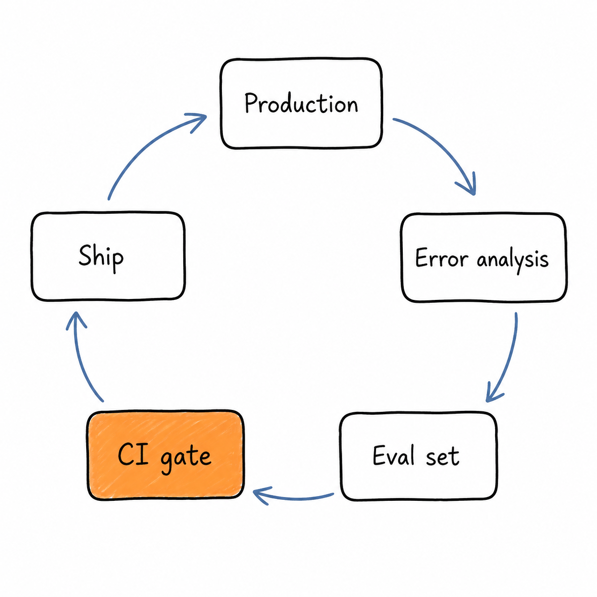
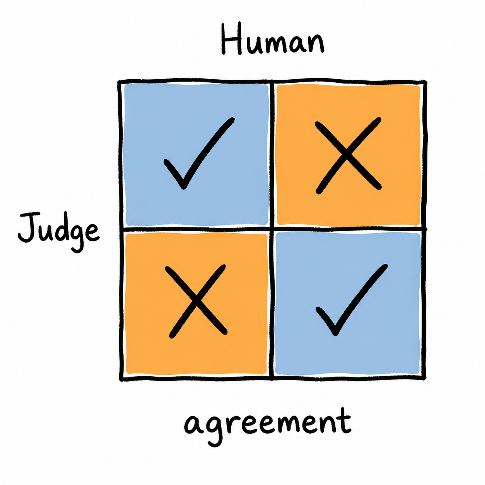
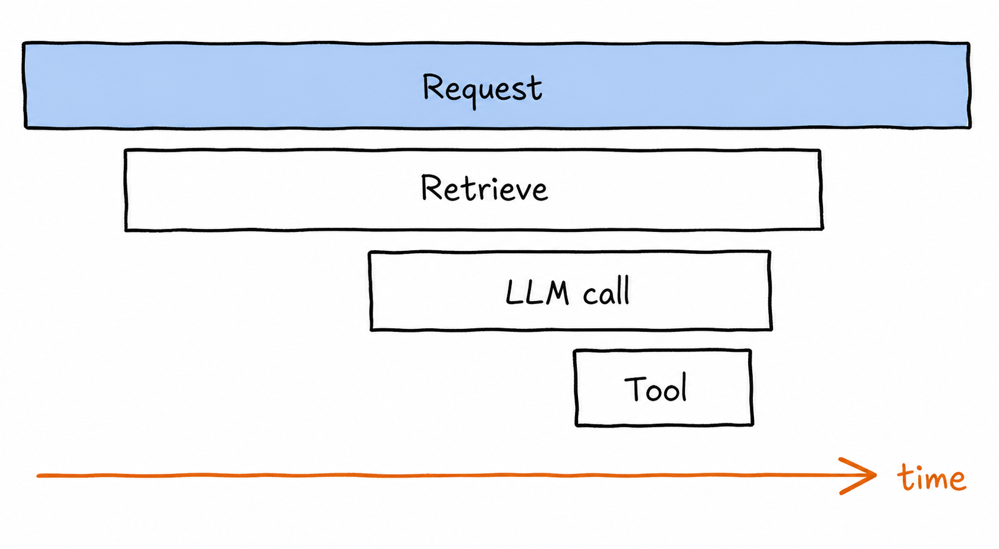

# 05 · Evaluation & Observability

> The skill that most separates AI engineers from people who call AI APIs. Everything else is downstream of being able to measure.

## Why This Matters

Without evals you cannot answer the only questions that matter: did that prompt change help? is the cheaper model good enough? did last night's deploy regress anything? Teams without evals ship by vibes, argue by anecdote, and discover regressions from users. Teams with evals iterate ten times faster because every change produces a number. This module is deliberately placed before deployment: **build the eval harness before you optimize anything**, because optimization without measurement is a random walk with a credit card attached.

---

## Key Subtopics

### 5.1 Eval fundamentals and error analysis

  

Start with **error analysis**, not metrics. Take 50–100 real outputs, read them, and write down what's wrong with each in plain language. Cluster those notes into a failure taxonomy — that taxonomy tells you what to measure and what to fix, in priority order. Then build the eval set: real inputs (not synthetic ones you invented), covering the common path, the known failure clusters, and the edge cases. Prefer cheap deterministic checks wherever they apply — schema validity, regex/keyword presence, numeric tolerance, citation resolution, exact match on extraction fields — and reserve model-graded evaluation for genuinely subjective dimensions. Keep a small **golden set** frozen for regression, and grow a larger set from production traces.

- [Hamel Husain: Your AI product needs evals](https://hamel.dev/blog/posts/evals/) — the canonical practitioner post
- [Applied LLMs: What we've learned from a year of building with LLMs](https://applied-llms.org/) — the eval sections especially
- [Eugene Yan: Task-specific LLM evals](https://eugeneyan.com/writing/evals/)

### 5.2 LLM-as-judge and judge calibration

  

For open-ended output, use a model as grader — carefully. Rules that matter: give the judge a **specific rubric with a small discrete scale** (binary pass/fail beats 1–10, which produces noise dressed as precision); prefer **pairwise comparison** to absolute scoring when ranking variants; and **calibrate against human labels** — hand-label 50 examples, measure agreement, and iterate on the judge prompt until agreement is ≥80%. An uncalibrated judge is a random number generator with good manners. Known biases: position bias in pairwise setups (randomize order), verbosity bias (longer answers score higher), and self-preference (models favour their own output — use a different model family as judge where you can).

- [Judging LLM-as-a-Judge with MT-Bench and Chatbot Arena](https://arxiv.org/abs/2306.05685) — measures the biases directly
- [Hamel Husain: Creating a LLM-as-a-Judge that drives business results](https://hamel.dev/blog/posts/llm-judge/)
- [Anthropic: Empirical evaluations guide](https://docs.claude.com/en/docs/test-and-evaluate/develop-tests)

### 5.3 Tracing, metrics, and OTel GenAI conventions

Observability for LLM systems is distributed tracing with extra attributes. A **trace** covers one user request; **spans** cover each LLM call, retrieval, and tool invocation. Every LLM span should carry: model ID and version, prompt ID and version, full input and output, token counts (input/output/cached/reasoning), cost, latency split into TTFT and total, temperature and other params, and stop reason. OpenTelemetry's GenAI semantic conventions standardize these attribute names so you're not locked into one vendor. Then instrument the aggregate dashboards: cost per request, p50/p95/p99 latency, error and timeout rate, cache hit rate, refusal rate, and token spend by feature.

- [OpenTelemetry GenAI semantic conventions](https://opentelemetry.io/docs/specs/semconv/gen-ai/)
- [Langfuse tracing docs](https://langfuse.com/docs/tracing) · [Arize Phoenix](https://arize.com/docs/phoenix) — OSS, self-hostable
- [OpenLLMetry](https://github.com/traceloop/openllmetry) — OTel-native auto-instrumentation

### 5.4 Production feedback loops and CI regression gates

Offline evals catch regressions; production tells you what to evaluate next. Capture explicit signals (thumbs, edits, corrections) and implicit ones (retry, abandonment, copy, escalation to human), and route low-scoring traces back into the eval set — that loop is what makes the harness improve over time. In CI, run the golden set on every PR that touches a prompt, model, tool schema, or retrieval config, and **fail the build on regression** against a committed baseline. Track cost and latency in the same gate; a change that improves accuracy 1% and triples cost should be a conscious decision, not a surprise. Guardrails (input/output filters, PII redaction, jailbreak classifiers) belong here too — they're online evals with teeth.

- [Guardrails AI](https://www.guardrailsai.com/docs) · [NVIDIA NeMo Guardrails](https://docs.nvidia.com/nemo/guardrails/) · [Llama Guard](https://huggingface.co/meta-llama/Llama-Guard-3-8B)
- [promptfoo: CI/CD integration](https://www.promptfoo.dev/docs/integrations/github-action/)
- [Eugene Yan: Patterns for building LLM-based systems](https://eugeneyan.com/writing/llm-patterns/)

### 5.5 Agent and RAG-specific evaluation

Multi-step systems need more than final-answer scoring.

- **RAG**: evaluate retrieval (recall@k, nDCG) and generation (faithfulness, answer relevance, citation validity) separately. See [Module 03](../03-retrieval-and-rag/README.md#35-rag-evaluation-and-failure-modes).
- **Agents**: score the **trajectory** — was the right tool chosen, with valid arguments, in a sensible order? Track steps-to-completion, cost per task, recovery rate after tool errors, and termination reason distribution. An agent that reaches the right answer in 18 flailing steps has a latent reliability problem.
- **Regression on tool schemas**: changing a tool description changes model behaviour. Treat it like a prompt change and gate it.

Benchmarks like SWE-bench and τ-bench are useful for calibrating expectations about frontier capability, but your production eval set is the only thing that predicts your production quality.

- [τ-bench: tool-agent-user interaction benchmark](https://arxiv.org/abs/2406.12045)
- [SWE-bench](https://www.swebench.com/) — realistic agentic coding evaluation
- [Inspect (UK AI Safety Institute)](https://inspect.aisi.org.uk/) — rigorous, scriptable eval framework

---

## Tools & Frameworks Used in Industry

| Purpose | Tools |
|---|---|
| Tracing & observability | [Langfuse](https://langfuse.com/), [LangSmith](https://docs.smith.langchain.com/), [Arize Phoenix](https://phoenix.arize.com/), [Braintrust](https://www.braintrust.dev/), [W&B Weave](https://weave-docs.wandb.ai/), [Helicone](https://www.helicone.ai/) |
| Eval frameworks | [promptfoo](https://www.promptfoo.dev/), [DeepEval](https://docs.confident-ai.com/), [Ragas](https://docs.ragas.io/), [Inspect](https://inspect.aisi.org.uk/), [OpenAI Evals](https://github.com/openai/evals) |
| Standards | [OpenTelemetry GenAI semconv](https://opentelemetry.io/docs/specs/semconv/gen-ai/), OpenLLMetry |
| Guardrails | Guardrails AI, NeMo Guardrails, Llama Guard, [Lakera](https://www.lakera.ai/) |
| Labeling & review | [Argilla](https://argilla.io/), [Label Studio](https://labelstud.io/), a spreadsheet (genuinely fine to start) |
| Dashboards | Grafana + Prometheus, Datadog LLM Observability, provider consoles |

> Two OSS defaults that cover most needs: **Langfuse** for tracing (self-hostable, OTel-compatible) and **promptfoo** for CI evals.

---

## Hands-On Project: Eval Harness Wired Into CI

**Take any system you built in Modules 02–04 and make its quality measurable and defended.**

Requirements:
1. **Error analysis first**: read 50 real outputs, write a failure taxonomy with counts. Commit it as `notes/failure-taxonomy.md`.
2. Build a **golden set** of 100 labeled examples covering the common path plus every failure cluster.
3. Implement deterministic checks wherever possible (schema validity, citation resolution, field-level exact match).
4. Add an **LLM judge** for one subjective dimension. Calibrate it: hand-label 50, report agreement with the judge, iterate the rubric until ≥80%.
5. Instrument tracing on the live app with OTel-compatible attributes: model, prompt version, tokens, cost, TTFT, total latency, stop reason.
6. Add a **GitHub Action** that runs the golden set on every PR touching prompts/models/tools and fails on accuracy regression >2% or cost regression >20% against a committed baseline.
7. Build a feedback route that pushes any thumbs-down production trace into a review queue and, once labeled, into the eval set.

**Done when:** a PR that degrades quality gets blocked by CI automatically, and you can produce judge-vs-human agreement as a number.

**Stretch:** add trajectory evaluation for the [Module 04](../04-agents-and-tool-use/README.md) agent — tool-choice accuracy and steps-to-completion as gated metrics.

---

## Common Pitfalls

- **Vibes-based evaluation.** "It looks better" is not a result. It's how regressions ship.
- **Skipping error analysis.** Metrics chosen before reading outputs measure what's easy, not what's broken.
- **Uncalibrated judges.** If you never measured agreement with humans, you don't know what the score means.
- **Judging with the same model and prompt that generated the output.** Self-preference bias makes the score flattering and useless.
- **1–10 rating scales.** Models cluster at 7–8. Use binary or a 3-point rubric with explicit criteria.
- **Synthetic-only eval data.** Real inputs are messier, and the mess is where the failures live.
- **Test set leakage.** Once you've tuned prompts against the golden set for weeks, it's a training set. Hold out a fresh slice.
- **Offline evals only.** Production distribution drifts away from your fixed set within weeks.
- **Not logging prompt and model versions on every trace.** Then a quality shift is unattributable, and provider model updates look like ghosts.
- **Ignoring cost and latency in the gate.** Quality-only gates let cost creep 3× one PR at a time.
- **Chasing public benchmarks.** SWE-bench is not your users.

---

## Progress

- [ ] 5.1 Eval fundamentals and error analysis
- [ ] 5.2 LLM-as-judge and judge calibration
- [ ] 5.3 Tracing, metrics, and OTel GenAI conventions
- [ ] 5.4 Production feedback loops and CI regression gates
- [ ] 5.5 Agent and RAG-specific evaluation
- [ ] **Project:** eval harness wired into CI

---

[← 04 · Agents & Tool Use](../04-agents-and-tool-use/README.md) · [Back to root](../README.md) · [Next: 06 · Deployment & AI Infra →](../06-deployment-and-ai-infra/README.md)
