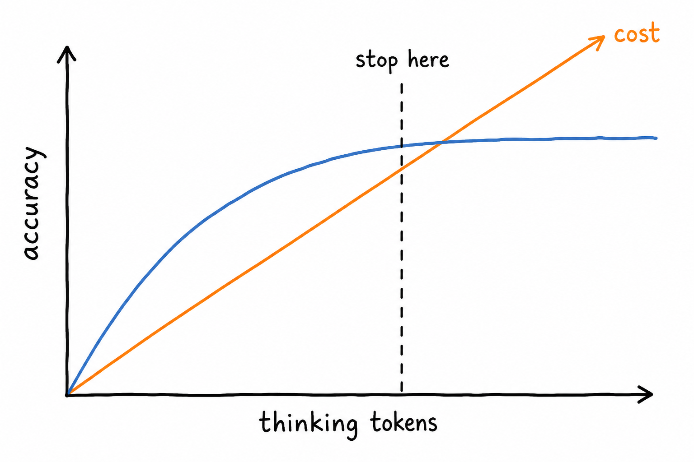
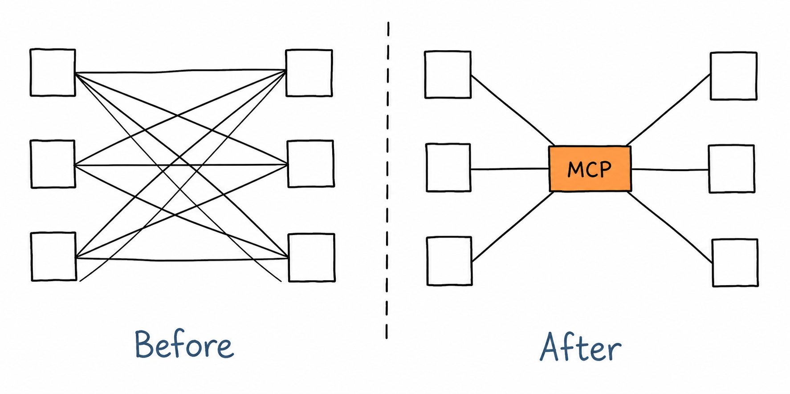
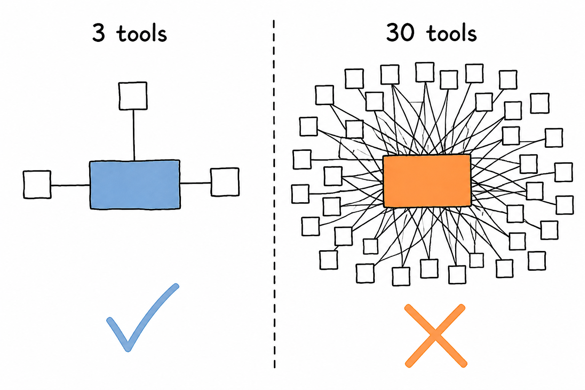
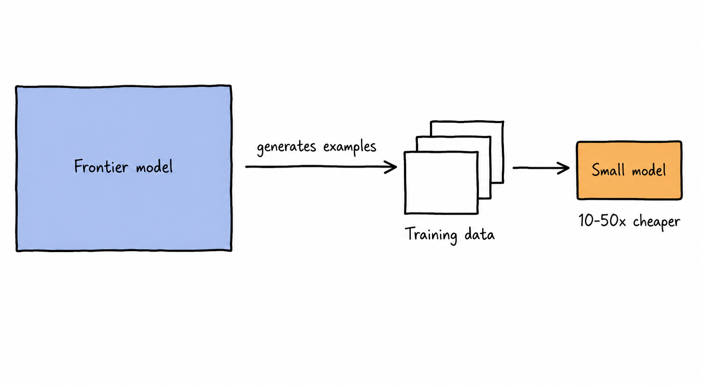

# 07 · Emerging Topics

> The frontier, dated. Everything here is true as of **August 2026** and some of it will be wrong by the time you read it — that's the point of the module.

## Why This Matters

The valuable skill isn't knowing today's frontier; it's having a repeatable process for evaluating a new capability without either dismissing it or believing the demo. This module covers the areas that moved most in the last 12–18 months, each with the same question attached: *what does this change about how I'd build the system?* Pair it with [hot-topics.md](../hot-topics.md), which tracks velocity and tells you what to re-read and when.

---

## Key Subtopics

### 7.1 Reasoning models and test-time compute

Models trained with RL to produce long internal reasoning chains before answering — spending compute at inference rather than training time. They substantially improve math, code, planning, and multi-step analysis, and most providers now expose a **thinking budget** so you can trade cost and latency for accuracy per request. The engineering implications: reasoning tokens are billed as output and can dwarf the visible answer; TTFT gets much worse, so streaming UX needs rethinking (show the model is working, or show summarized reasoning); explicit chain-of-thought prompting becomes redundant or harmful; and for extraction, routing, and formatting, reasoning models are usually the wrong tool. Route per task, not per product.

- [Scaling LLM Test-Time Compute Optimally](https://arxiv.org/abs/2408.03314)
- [DeepSeek-R1](https://arxiv.org/abs/2501.12948) — the open recipe that made RL-for-reasoning reproducible
- [Anthropic: Extended thinking](https://docs.claude.com/en/docs/build-with-claude/extended-thinking)

### 7.2 Agentic coding and SWE agents

The fastest-moving applied area, and the one most likely to change your own daily workflow. Agents now routinely resolve real GitHub issues end to end, and the interesting engineering has shifted from the model to the **harness**: how the agent explores a repo, what context it keeps, how it runs tests, how it recovers from failure, and where humans approve. Practical patterns worth learning: repo-level instruction files that give agents standing context; sub-agents for parallel, context-isolated searching; sandboxed execution with test-driven verification loops; and review workflows built on the assumption that volume of generated code has gone up while the reviewing bottleneck has not. See [soft-skills.md](../soft-skills.md#1-reviewing-ai-generated-code) — reviewing this output well is now a core competency.

- [SWE-bench](https://www.swebench.com/) and [SWE-bench Verified](https://openai.com/index/introducing-swe-bench-verified/)
- [Anthropic: Claude Code best practices](https://www.anthropic.com/engineering/claude-code-best-practices)
- [Anthropic: Building effective agents](https://www.anthropic.com/engineering/building-effective-agents)

### 7.3 Protocols and interoperability

**MCP** has become the de-facto standard for connecting models to tools and data — servers exist for most common systems, and the questions have moved from "will this be adopted?" to operational ones: authorization and scoping, server trust and supply chain, tool-name collisions, and how much of a tool catalog you can expose before the model degrades. **A2A (Agent2Agent)** addresses agent-to-agent delegation across organizational boundaries; it's real but earlier. The open problems worth tracking: agent **identity and auth** (an agent acting on a user's behalf needs delegated, scoped, revocable credentials — OAuth wasn't designed for this), and machine-to-machine **payments**. Build behind a thin abstraction; these specs are still moving.

*Connecting everything is not a strategy — tool selection is a model decision, and it degrades as the catalog grows. Curate per agent.*

- [Model Context Protocol specification](https://modelcontextprotocol.io/specification)
- [MCP security best practices](https://modelcontextprotocol.io/specification/draft/basic/security_best_practices)
- [A2A Protocol](https://a2a-protocol.org/)

### 7.4 Multimodal, realtime, and computer use

Vision-language models have made **document AI** genuinely work — feeding page images to a VLM often beats a text-extraction pipeline on complex layouts, tables, and charts, which quietly rewrites the ingestion advice in [Module 03](../03-retrieval-and-rag/README.md). **Realtime speech-to-speech** APIs collapse the old STT→LLM→TTS chain into one low-latency stream, making voice agents viable but bringing new problems: interruption handling, turn detection, and evaluating conversations rather than completions. **Computer use** — agents driving GUIs from screenshots — unlocks systems with no API but remains slow, brittle, and a large security surface; scope it tightly and sandbox it hard.

- [Anthropic: Vision](https://docs.claude.com/en/docs/build-with-claude/vision) · [Computer use](https://docs.claude.com/en/docs/agents-and-tools/computer-use)
- [OpenAI Realtime API](https://platform.openai.com/docs/guides/realtime)
- [ColPali: Efficient Document Retrieval with Vision Language Models](https://arxiv.org/abs/2407.01449) — retrieval directly over page images

### 7.5 Small models, distillation, and on-device

The capability floor keeps rising: models in the 1–8B range now handle classification, extraction, routing, and summarization at quality that required frontier models two years ago. That makes **distillation** — using a frontier model to generate training data for a small one you serve yourself — one of the most reliable cost plays available, frequently 10–50× cheaper per token at parity on a narrow task. On-device inference (phones, laptops, edge) matters for privacy-constrained and offline use cases, with quantized GGUF models, Apple Silicon (MLX), and NPU-backed runtimes as the practical stack. The architecture implication: a mature system is a **portfolio** of models routed by task, not one model doing everything.

- [Unsloth](https://docs.unsloth.ai/) · [MLX](https://ml-explore.github.io/mlx/) · [llama.cpp](https://github.com/ggml-org/llama.cpp)
- [Distilling Step-by-Step](https://arxiv.org/abs/2305.02301) — small models beating larger ones with less data
- [Phi / Gemma / Qwen / Llama model cards on Hugging Face](https://huggingface.co/models) — track the small-model frontier

### 7.6 Safety, interpretability, and governance

Two threads worth following even if you never work on safety directly. **Interpretability** has moved from theory to tooling — sparse autoencoders recover human-interpretable features from activations, and feature steering is starting to appear as a practical control surface. **Governance** has become a delivery constraint: the EU AI Act's obligations are phasing in through 2026–2027, and NIST's AI RMF is the common framework for US enterprise risk reviews. If you build for enterprise or regulated markets, documentation of intended use, evaluation results, data provenance, and human oversight is increasingly a shipping requirement, not paperwork after the fact.

- [Scaling Monosemanticity](https://transformer-circuits.pub/2024/scaling-monosemanticity/) — interpretability at frontier scale
- [EU AI Act](https://artificialintelligenceact.eu/) — timelines and obligations by risk tier
- [NIST AI Risk Management Framework](https://www.nist.gov/itl/ai-risk-management-framework)

---

## Tools & Frameworks Used in Industry

| Purpose | Tools |
|---|---|
| Reasoning-model access | Anthropic extended thinking, OpenAI reasoning models, Gemini thinking, DeepSeek-R1 (open weights) |
| Agentic coding | [Claude Code](https://claude.com/claude-code), OpenAI Codex, [Cursor](https://cursor.com/), [Aider](https://aider.chat/), [OpenHands](https://github.com/All-Hands-AI/OpenHands) |
| Protocols | MCP servers/SDKs, A2A, [FastMCP](https://gofastmcp.com/) |
| Multimodal & realtime | OpenAI Realtime API, [LiveKit Agents](https://docs.livekit.io/agents/), [Pipecat](https://docs.pipecat.ai/), [ColPali](https://github.com/illuin-tech/colpali) |
| Small / on-device | Ollama, llama.cpp, [MLX](https://ml-explore.github.io/mlx/), Unsloth, [ONNX Runtime](https://onnxruntime.ai/) |
| Interpretability | [TransformerLens](https://transformerlensorg.github.io/TransformerLens/), [SAELens](https://github.com/jbloomAus/SAELens), [Neuronpedia](https://www.neuronpedia.org/) |

---

## Hands-On Project: Capability Memo on One Emerging Area

**Practice the actual skill: evaluating a new capability like an engineer, not a spectator.**

Pick one subtopic above and produce a decision memo (2 pages max) backed by code:

1. **Claim under test** — state it precisely. "Reasoning models improve our multi-step extraction accuracy enough to justify the cost," not "reasoning models are better."
2. **Reproduce** — build the smallest working implementation. Get it running yourself; do not rely on a vendor demo.
3. **Measure** — run it on *your* eval set from [Module 05](../05-evaluation-and-observability/README.md). Report accuracy, cost per task, and p95 latency against your current baseline.
4. **Break it** — find the failure modes. What inputs make it worse than the baseline? What happens at the edges?
5. **Recommend** — adopt / pilot / revisit in 6 months, with the specific condition that would change your answer.
6. **Date it** — record the model versions, library versions, and date. Memos expire.

**Done when:** someone else could read the memo and make the same call without re-running your experiments.

**Suggested claims:** page-image retrieval (ColPali-style) beats text extraction on our PDFs · a distilled 8B model matches the frontier model on our classification task at 20× lower cost · MCP replaces our bespoke tool integrations · a voice agent hits acceptable turn latency for our support flow.

---

## Common Pitfalls

- **Chasing demos.** A curated video is an existence proof, not a distribution. Reproduce before you believe.
- **Adopting an unstable API without an abstraction layer.** Wrap it thinly so a spec change is a one-file fix.
- **Assuming benchmark gains transfer.** SWE-bench improvements do not linearly predict your codebase, your tests, or your users.
- **Treating reasoning models as a drop-in upgrade.** Slower, pricier, and worse at some simple tasks. Route per task.
- **Ignoring reasoning-token cost.** Hidden thinking still bills as output and can be 10× the visible answer.
- **Exposing a huge MCP tool catalog.** Too many tools degrades selection accuracy. Curate what each agent can see.
- **Fine-tuning a small model before proving prompting has plateaued.** See [Module 06](../06-deployment-and-ai-infra/README.md#64-fine-tuning-vs-rag-vs-prompting).
- **Deploying computer use broadly.** Wide GUI control plus untrusted content is the largest attack surface in this repo.
- **Undated notes.** Anything you write here needs a date and model versions attached or it becomes misinformation in six months.

---

## Progress

- [ ] 7.1 Reasoning models and test-time compute
- [ ] 7.2 Agentic coding and SWE agents
- [ ] 7.3 Protocols and interoperability
- [ ] 7.4 Multimodal, realtime, and computer use
- [ ] 7.5 Small models, distillation, and on-device
- [ ] 7.6 Safety, interpretability, and governance
- [ ] **Project:** capability memo on one emerging area

---

[← 06 · Deployment & AI Infra](../06-deployment-and-ai-infra/README.md) · [Back to root](../README.md) · [Next: Capstone →](../capstone.md)
