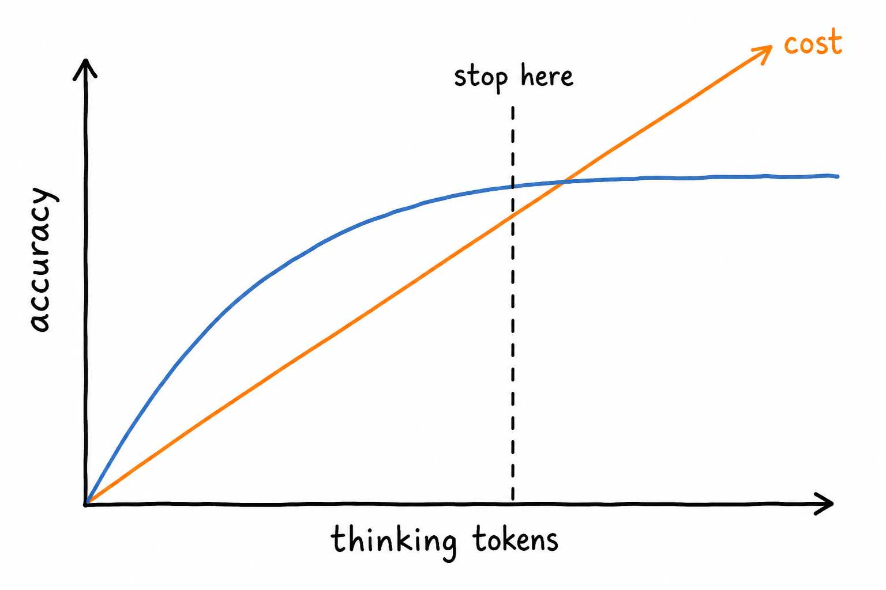
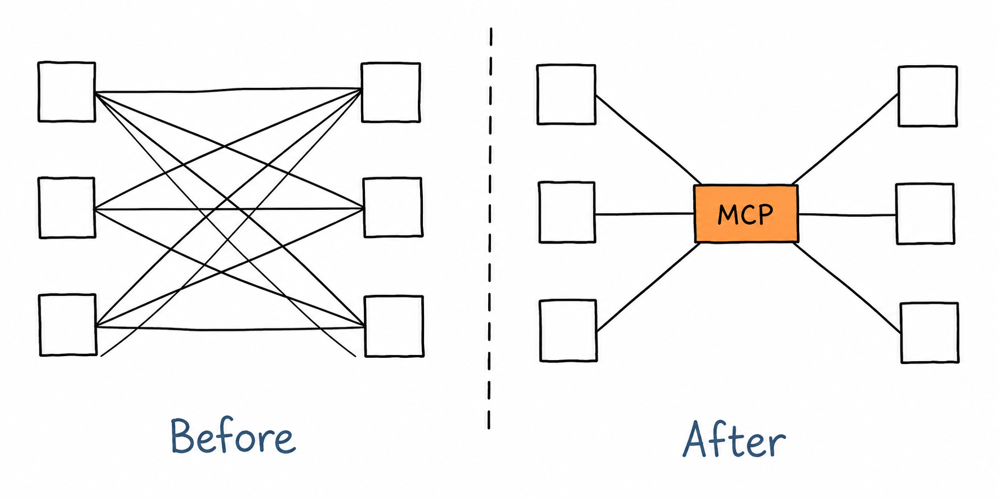
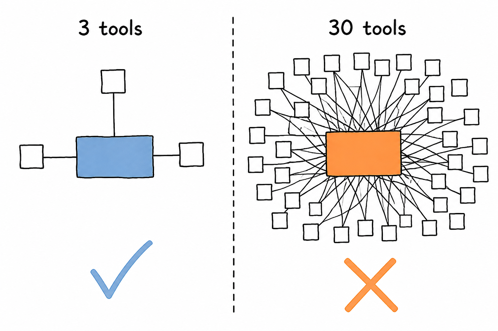
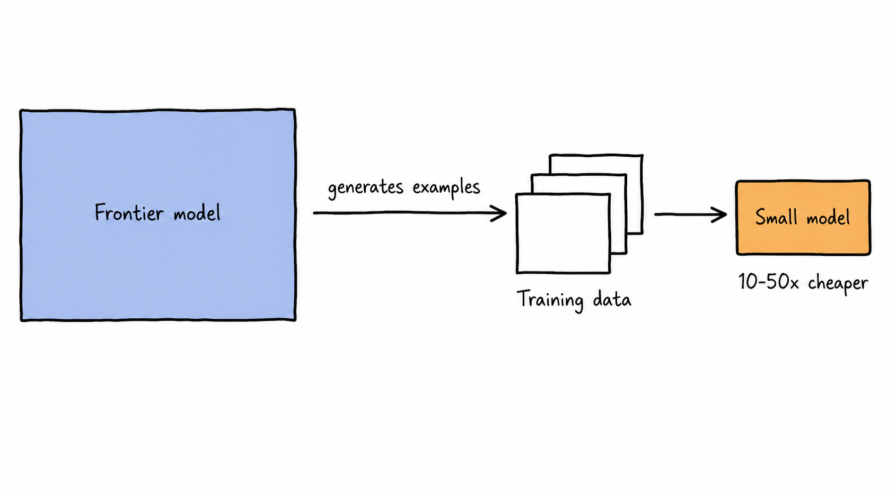

# 07 · Emerging Topics

> The frontier, dated. Everything here is true as of **August 2026** and some of it will be wrong by the time you read it — that's the point of the module.

## Why This Matters

The valuable skill isn't knowing today's frontier; it's having a repeatable process for evaluating a new capability without either dismissing it or believing the demo. This module covers the areas that moved most in the last 12–18 months, each with the same question attached: *what does this change about how I'd build the system?* Pair it with [hot-topics.md](../hot-topics.md), which tracks velocity and tells you what to re-read and when.

---

## Key Subtopics

### 7.1 Reasoning models and test-time compute

Models trained with RL to produce long internal reasoning chains before answering — spending compute at inference rather than training time. They substantially improve math, code, planning, and multi-step analysis, and most providers now expose a **thinking budget** so you can trade cost and latency for accuracy per request. The engineering implications: reasoning tokens are billed as output and can dwarf the visible answer; TTFT gets much worse, so streaming UX needs rethinking (show the model is working, or show summarized reasoning); explicit chain-of-thought prompting becomes redundant or harmful; and for extraction, routing, and formatting, reasoning models are usually the wrong tool. Route per task, not per product.

- [Scaling LLM Test-Time Compute Optimally](https://arxiv.org/abs/2408.03314)
- [DeepSeek-R1](https://arxiv.org/abs/2501.12948) — the open recipe that made RL-for-reasoning reproducible
- [Anthropic: Extended thinking](https://docs.claude.com/en/docs/build-with-claude/extended-thinking)

### 7.2 Agentic coding and SWE agents

The fastest-moving applied area, and the one most likely to change your own daily workflow. Agents now routinely resolve real GitHub issues end to end, and the interesting engineering has shifted from the model to the **harness**: how the agent explores a repo, what context it keeps, how it runs tests, how it recovers from failure, and where humans approve. Practical patterns worth learning: repo-level instruction files that give agents standing context; sub-agents for parallel, context-isolated searching; sandboxed execution with test-driven verification loops; and review workflows built on the assumption that volume of generated code has gone up while the reviewing bottleneck has not. See [soft-skills.md](../soft-skills.md#1-reviewing-ai-generated-code) — reviewing this output well is now a core competency.

- [SWE-bench](https://www.swebench.com/) and [SWE-bench Verified](https://openai.com/index/introducing-swe-bench-verified/)
- [Anthropic: Claude Code best practices](https://www.anthropic.com/engineering/claude-code-best-practices)
- [Anthropic: Building effective agents](https://www.anthropic.com/engineering/building-effective-agents)

### 7.3 Protocols and interoperability

**MCP** has become the de-facto standard for connecting models to tools and data — servers exist for most common systems, and the questions have moved from "will this be adopted?" to operational ones: authorization and scoping, server trust and supply chain, tool-name collisions, and how much of a tool catalog you can expose before the model degrades. **A2A (Agent2Agent)** addresses agent-to-agent delegation across organizational boundaries; it's real but earlier. The open problems worth tracking: agent **identity and auth** (an agent acting on a user's behalf needs delegated, scoped, revocable credentials — OAuth wasn't designed for this), and machine-to-machine **payments**. Build behind a thin abstraction; these specs are still moving.

*Connecting everything is not a strategy — tool selection is a model decision, and it degrades as the catalog grows. Curate per agent.*

- [Model Context Protocol specification](https://modelcontextprotocol.io/specification)
- [MCP security best practices](https://modelcontextprotocol.io/specification/draft/basic/security_best_practices)
- [A2A Protocol](https://a2a-protocol.org/)

### 7.4 Multimodal, realtime, and computer use

Vision-language models have made **document AI** genuinely work — feeding page images to a VLM often beats a text-extraction pipeline on complex layouts, tables, and charts, which quietly rewrites the ingestion advice in [Module 03](../03-retrieval-and-rag/README.md). **Realtime speech-to-speech** APIs collapse the old STT→LLM→TTS chain into one low-latency stream, making voice agents viable but bringing new problems: interruption handling, turn detection, and evaluating conversations rather than completions. **Computer use** — agents driving GUIs from screenshots — unlocks systems with no API but remains slow, brittle, and a large security surface; scope it tightly and sandbox it hard.

- [Anthropic: Vision](https://docs.claude.com/en/docs/build-with-claude/vision) · [Computer use](https://docs.claude.com/en/docs/agents-and-tools/computer-use)
- [OpenAI Realtime API](https://platform.openai.com/docs/guides/realtime)
- [ColPali: Efficient Document Retrieval with Vision Language Models](https://arxiv.org/abs/2407.01449) — retrieval directly over page images

### 7.5 Small models, distillation, and on-device

The capability floor keeps rising: models in the 1–8B range now handle classification, extraction, routing, and summarization at quality that required frontier models two years ago. That makes **distillation** — using a frontier model to generate training data for a small one you serve yourself — one of the most reliable cost plays available, frequently 10–50× cheaper per token at parity on a narrow task. On-device inference (phones, laptops, edge) matters for privacy-constrained and offline use cases, with quantized GGUF models, Apple Silicon (MLX), and NPU-backed runtimes as the practical stack. The architecture implication: a mature system is a **portfolio** of models routed by task, not one model doing everything.

- [Unsloth](https://docs.unsloth.ai/) · [MLX](https://ml-explore.github.io/mlx/) · [llama.cpp](https://github.com/ggml-org/llama.cpp)
- [Distilling Step-by-Step](https://arxiv.org/abs/2305.02301) — small models beating larger ones with less data
- [Phi / Gemma / Qwen / Llama model cards on Hugging Face](https://huggingface.co/models) — track the small-model frontier

### 7.6 Safety, interpretability, and governance

Two threads worth following even if you never work on safety directly. **Interpretability** has moved from theory to tooling — sparse autoencoders recover human-interpretable features from activations, and feature steering is starting to appear as a practical control surface. **Governance** has become a delivery constraint: the EU AI Act's obligations are phasing in through 2026–2027, and NIST's AI RMF is the common framework for US enterprise risk reviews. If you build for enterprise or regulated markets, documentation of intended use, evaluation results, data provenance, and human oversight is increasingly a shipping requirement, not paperwork after the fact.

- [Scaling Monosemanticity](https://transformer-circuits.pub/2024/scaling-monosemanticity/) — interpretability at frontier scale
- [EU AI Act](https://artificialintelligenceact.eu/) — timelines and obligations by risk tier
- [NIST AI Risk Management Framework](https://www.nist.gov/itl/ai-risk-management-framework)

### 7.7 Code execution and progressive disclosure

Tool use has a token problem: loading every tool definition into context, then round-tripping one call at a time with every intermediate result passing back through the model, is expensive and degrades tool selection. The emerging answer is to let the model **write code that calls the tools** — MCP servers presented to the agent as a typed API it imports — so filtering, joining, and looping happen inside the execution environment and only the result re-enters context (Anthropic reported one workflow dropping from ~150k to ~2k tokens this way). The same principle applied to instructions is **progressive disclosure**: keep a one-line index in context and load the body on demand — the idea behind Agent Skills, folders of instructions and scripts whose name and description are always present but whose contents are read only when relevant. What it changes for you: your tool layer becomes an API surface to design rather than a prompt to dump, sandboxed execution stops being optional ([Module 04](../04-agents-and-tool-use/README.md#44-environments-and-protocols-mcp-sandboxes-computer-use)), and the dominant failure mode moves from "picked the wrong tool" to "wrote wrong code" — which is at least testable.

- [Executable Code Actions Elicit Better LLM Agents](https://arxiv.org/abs/2402.01030) — the CodeAct result underneath the trend
- [Anthropic: Code execution with MCP](https://www.anthropic.com/engineering/code-execution-with-mcp) · [Cloudflare: Code Mode](https://blog.cloudflare.com/code-mode/)
- [Agent Skills](https://docs.claude.com/en/docs/agents-and-tools/agent-skills) — progressive disclosure as a file format

### 7.8 RL environments and agent post-training

Post-training's centre of gravity moved from SFT on human demonstrations to **RL against verifiable rewards (RLVR)**: grade the rollout with a checker — unit tests, exact match, a schema validator, a simulator — instead of a learned preference model, and the reward signal stops being the bottleneck. **GRPO** made the loop cheap by dropping the value network and scoring a group of sampled answers against each other, which is why single-node runs are now routine. The scarce asset is no longer the dataset but the **environment**: a runnable task with a reset, tools the model can call, and a programmatic grader — hence the environment hubs and open environment specs that appeared in 2025. Why an application engineer should care: if your task has an automatic checker, a tuned 4–8B model can beat a frontier model *on that task* at a fraction of the cost, and your eval harness from [Module 05](../05-evaluation-and-observability/README.md) is already most of an environment. Expect **reward hacking** — the policy optimizes the checker, not the task — so keep a human-graded holdout you never train against.

- [DeepSeekMath](https://arxiv.org/abs/2402.03300) — the GRPO paper · [Tulu 3](https://arxiv.org/abs/2411.15124) — RLVR inside an open post-training recipe
- [verl](https://github.com/volcengine/verl) · [TRL](https://huggingface.co/docs/trl) · [Unsloth](https://docs.unsloth.ai/) — the practical RL stack
- [Prime Intellect Environments Hub](https://app.primeintellect.ai/dashboard/environments) · [OpenEnv](https://github.com/meta-pytorch/OpenEnv) — environments as shareable artifacts

### 7.9 Long-horizon agents: context rot, memory, and self-improvement

Context windows grew faster than the ability to use them. Measured carefully, accuracy degrades as input length grows even on tasks that fit comfortably inside the limit — **context rot** — and long-horizon failure is usually not a reasoning failure but per-step accuracy compounding: 99% per step is a coin flip over 70 steps. That reframes long-running agents as a reliability problem rather than a capability one. What holds up in practice: keep the working window deliberately small (compaction, note files, sub-agents with isolated context — [02.4](../02-prompting-and-context-engineering/README.md#24-context-engineering-assembly-compaction-and-caching) and [04.3](../04-agents-and-tool-use/README.md#43-memory-and-state-management)); give the agent **durable external memory** it writes and re-reads instead of carrying history forward; and measure **step accuracy across a trajectory**, not just the final answer. The frontier piece is self-improvement — agents that write reusable notes or skills after a task and load them next time. Real gains, and a real way to accumulate confidently-worded garbage if nothing ever prunes the store.

- [Chroma: Context Rot](https://research.trychroma.com/context-rot) — measured degradation as input grows
- [The Illusion of Diminishing Returns: Measuring Long Horizon Execution in LLMs](https://arxiv.org/abs/2509.09677)
- [Anthropic: Effective context engineering for AI agents](https://www.anthropic.com/engineering/effective-context-engineering-for-ai-agents)

---

## Watchlist — Too Early to Build On

Real enough to track, not yet worth architecting around. Each row carries the condition that should promote it into a subtopic above — write that condition down, or you'll re-litigate the same debate every quarter.

| Area | What it is | Promote it when |
|---|---|---|
| **Diffusion language models** | Text generated by parallel iterative refinement rather than left-to-right decoding | One matches an autoregressive peer on your task with a latency win you can measure yourself |
| **Agent payments** | Protocols letting agents transact autonomously on a user's behalf | A payment provider you already use supports it and someone runs it in production |
| **Agent identity and delegated auth** | Scoped, revocable, auditable credentials for an agent acting as a user — OAuth wasn't designed for this | The spec work lands in your identity provider rather than in a blog post |
| **Continual / online learning** | Models updated from deployment feedback instead of discrete retrains | Someone publishes a rollback story, not just a gains number |
| **Sub-quadratic and hybrid architectures** | State-space and hybrid-attention stacks aimed at cheap long context | One ships as a default production model with quality parity at your context length |

---

## Tools & Frameworks Used in Industry

| Purpose | Tools |
|---|---|
| Reasoning-model access | Anthropic extended thinking, OpenAI reasoning models, Gemini thinking, DeepSeek-R1 (open weights) |
| Agentic coding | [Claude Code](https://claude.com/claude-code), OpenAI Codex, [Cursor](https://cursor.com/), [Aider](https://aider.chat/), [OpenHands](https://github.com/All-Hands-AI/OpenHands) |
| Protocols | MCP servers/SDKs, A2A, [FastMCP](https://gofastmcp.com/) |
| Multimodal & realtime | OpenAI Realtime API, [LiveKit Agents](https://docs.livekit.io/agents/), [Pipecat](https://docs.pipecat.ai/), [ColPali](https://github.com/illuin-tech/colpali) |
| Small / on-device | Ollama, llama.cpp, [MLX](https://ml-explore.github.io/mlx/), Unsloth, [ONNX Runtime](https://onnxruntime.ai/) |
| Interpretability | [TransformerLens](https://transformerlensorg.github.io/TransformerLens/), [SAELens](https://github.com/jbloomAus/SAELens), [Neuronpedia](https://www.neuronpedia.org/) |
| Code-execution tool use | MCP servers behind a sandbox ([E2B](https://e2b.dev/), Modal, [Pyodide](https://pyodide.org/)), [Agent Skills](https://docs.claude.com/en/docs/agents-and-tools/agent-skills) |
| Agent RL & environments | [verl](https://github.com/volcengine/verl), [TRL](https://huggingface.co/docs/trl) (GRPO), Unsloth, [OpenEnv](https://github.com/meta-pytorch/OpenEnv), Prime Intellect Environments Hub |
| Agent memory | [Letta](https://www.letta.com/), [Mem0](https://mem0.ai/), or plain files in git — start with files |

---

## Hands-On Project: Capability Memo on One Emerging Area

**Practice the actual skill: evaluating a new capability like an engineer, not a spectator.**

Pick one subtopic above and produce a decision memo (2 pages max) backed by code:

1. **Claim under test** — state it precisely. "Reasoning models improve our multi-step extraction accuracy enough to justify the cost," not "reasoning models are better."
2. **Reproduce** — build the smallest working implementation. Get it running yourself; do not rely on a vendor demo.
3. **Measure** — run it on *your* eval set from [Module 05](../05-evaluation-and-observability/README.md). Report accuracy, cost per task, and p95 latency against your current baseline.
4. **Break it** — find the failure modes. What inputs make it worse than the baseline? What happens at the edges?
5. **Recommend** — adopt / pilot / revisit in 6 months, with the specific condition that would change your answer.
6. **Date it** — record the model versions, library versions, and date. Memos expire.

**Done when:** someone else could read the memo and make the same call without re-running your experiments.

**Suggested claims:** page-image retrieval (ColPali-style) beats text extraction on our PDFs · a distilled 8B model matches the frontier model on our classification task at 20× lower cost · MCP replaces our bespoke tool integrations · a voice agent hits acceptable turn latency for our support flow.

---

## Common Pitfalls

- **Chasing demos.** A curated video is an existence proof, not a distribution. Reproduce before you believe.
- **Adopting an unstable API without an abstraction layer.** Wrap it thinly so a spec change is a one-file fix.
- **Assuming benchmark gains transfer.** SWE-bench improvements do not linearly predict your codebase, your tests, or your users.
- **Treating reasoning models as a drop-in upgrade.** Slower, pricier, and worse at some simple tasks. Route per task.
- **Ignoring reasoning-token cost.** Hidden thinking still bills as output and can be 10× the visible answer.
- **Exposing a huge MCP tool catalog.** Too many tools degrades selection accuracy. Curate what each agent can see.
- **Fine-tuning a small model before proving prompting has plateaued.** See [Module 06](../06-deployment-and-ai-infra/README.md#64-fine-tuning-vs-rag-vs-prompting).
- **Deploying computer use broadly.** Wide GUI control plus untrusted content is the largest attack surface in this repo.
- **Giving an agent a code sandbox without an egress policy.** Code execution turns every tool into a network primitive; scope what the sandbox can reach.
- **Running RL before you trust the grader.** The reward *is* the spec — a sloppy checker gets optimized exactly as written.
- **Treating a bigger context window as a memory system.** Accuracy degrades well before the limit; compaction and external memory are the fix.
- **Undated notes.** Anything you write here needs a date and model versions attached or it becomes misinformation in six months.

---

## Progress

- [ ] 7.1 Reasoning models and test-time compute
- [ ] 7.2 Agentic coding and SWE agents
- [ ] 7.3 Protocols and interoperability
- [ ] 7.4 Multimodal, realtime, and computer use
- [ ] 7.5 Small models, distillation, and on-device
- [ ] 7.6 Safety, interpretability, and governance
- [ ] 7.7 Code execution and progressive disclosure
- [ ] 7.8 RL environments and agent post-training
- [ ] 7.9 Long-horizon agents: context rot, memory, and self-improvement
- [ ] **Project:** capability memo on one emerging area

---

[← 06 · Deployment & AI Infra](../06-deployment-and-ai-infra/README.md) · [Back to root](../README.md) · [Next: Capstone →](../capstone.md)
