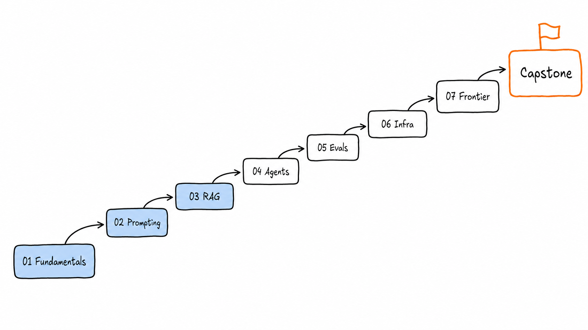
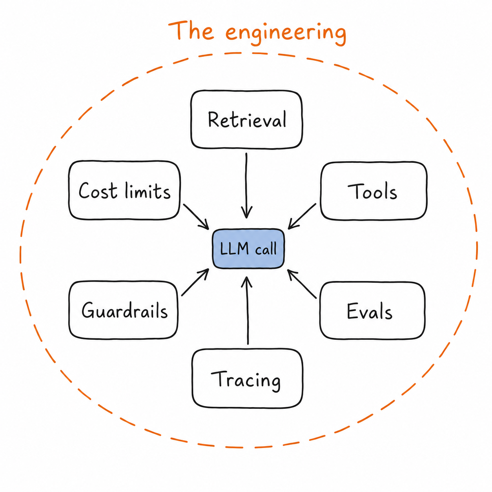
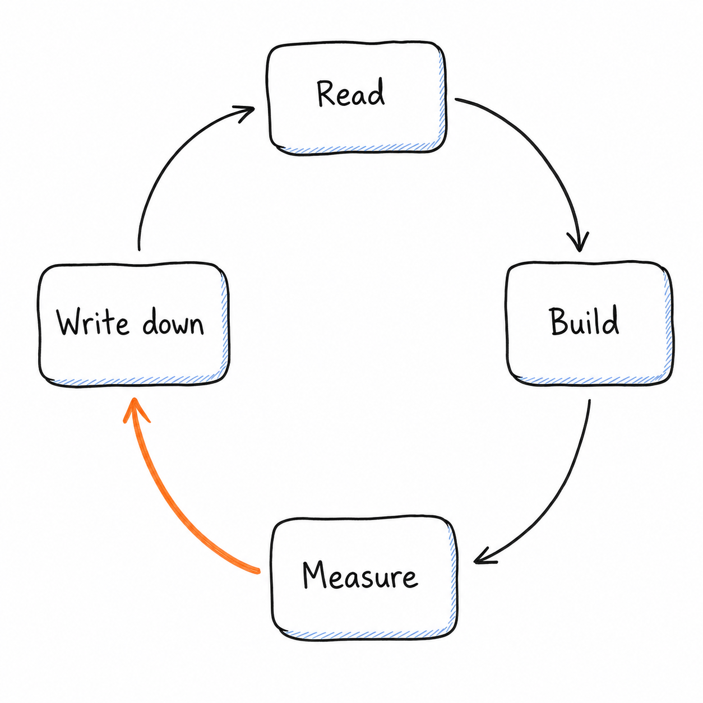

# The AI-Native Engineer

A structured, opinionated curriculum for software engineers moving into AI/ML engineering — the discipline that separates someone who can call an LLM API from someone who can design, evaluate, ship, and operate AI systems that hold up in production. It's built as plain markdown: seven modules from foundations to frontier, each with canonical resources, the tools actually used in industry, a hands-on project, and the pitfalls that bite people first. I'm writing it as I learn (publicly, mistakes included), and it's open for anyone making the same transition — self-taught devs, backend/full-stack engineers adding AI to their scope, and new grads who want depth beyond "I used the OpenAI SDK once."

> **Last reviewed:** August 2026 · See [hot-topics.md](hot-topics.md) for what's moving fast vs. what's settled.

---

## Table of Contents

| # | Module | What you'll be able to do |
|---|--------|---------------------------|
| 01 | [LLM Fundamentals](01-llm-fundamentals/README.md) | Explain what the model is actually doing, and pick one on evidence |
| 02 | [Prompting & Context Engineering](02-prompting-and-context-engineering/README.md) | Get reliable, structured output and manage the context window as a budget |
| 03 | [Retrieval & RAG](03-retrieval-and-rag/README.md) | Build retrieval that measurably finds the right thing |
| 04 | [Agents & Tool Use](04-agents-and-tool-use/README.md) | Design agent loops that terminate, recover, and stay in budget |
| 05 | [Evaluation & Observability](05-evaluation-and-observability/README.md) | Replace vibes with numbers, offline and in production |
| 06 | [Deployment & AI Infra](06-deployment-and-ai-infra/README.md) | Serve models at a known cost, latency, and failure profile |
| 07 | [Emerging Topics](07-emerging-topics/README.md) | Evaluate new capabilities without chasing demos |

**Cross-cutting files**

- [roadmap.md](roadmap.md) — **start here.** Which modules you actually need, in what order, and how to know when you're done
- [glossary.md](glossary.md) — every term in one place, plus the pairs people confuse
- [hot-topics.md](hot-topics.md) — what changed in the last 6–12 months vs. stable fundamentals
- [soft-skills.md](soft-skills.md) — reviewing AI-generated code, cost/latency tradeoffs, security awareness, communicating limitations
- [capstone.md](capstone.md) — the final project that combines every module

  

<em>Calling the model is the small box in the middle. This repo is about everything around it.</em>

---

## Progress Tracker

Fork the repo and tick these off as you go. A box is "done" when you can explain the idea to another engineer **and** you've shipped code that uses it.

### 01 · LLM Fundamentals
- [ ] Transformers and the attention mechanism
- [ ] Tokenization and the context window
- [ ] Embeddings and positional encoding
- [ ] Architecture variants: dense, MoE, multimodal
- [ ] The training lifecycle: pretraining → SFT → preference tuning
- [ ] Inference and decoding: sampling params, KV cache, streaming
- [ ] Why models hallucinate
- [ ] What LLMs are structurally bad at
- [ ] Precision, quantization, and model size
- [ ] Model selection, scaling laws, and reasoning models
- [ ] **Project:** model bake-off harness

### 02 · Prompting & Context Engineering
- [ ] Prompt anatomy and instruction following
- [ ] Few-shot examples and reasoning elicitation
- [ ] Structured output and schema enforcement
- [ ] Context engineering: assembly, compaction, and caching
- [ ] Prompt versioning, testing, and optimization
- [ ] **Project:** structured extraction pipeline

### 03 · Retrieval & RAG
- [ ] Embeddings and vector search
- [ ] Chunking, parsing, and index design
- [ ] Hybrid search and reranking
- [ ] Query understanding: rewriting, routing, filtering
- [ ] RAG evaluation and failure modes
- [ ] **Project:** cited answers over a real corpus

### 04 · Agents & Tool Use
- [ ] Tool calling and the agent loop
- [ ] Agent architectures: workflows vs. agents
- [ ] Memory and state management
- [ ] Environments and protocols (MCP, sandboxes, computer use)
- [ ] Reliability: budgets, retries, human-in-the-loop
- [ ] **Project:** bounded research agent with durable state

### 05 · Evaluation & Observability
- [ ] Eval fundamentals and error analysis
- [ ] LLM-as-judge and judge calibration
- [ ] Tracing, metrics, and OTel GenAI conventions
- [ ] Production feedback loops and CI regression gates
- [ ] Agent and RAG-specific evaluation
- [ ] **Project:** eval harness wired into CI

### 06 · Deployment & AI Infra
- [ ] Serving and inference optimization
- [ ] API-layer architecture: gateways, streaming, fallbacks
- [ ] Cost and latency engineering
- [ ] Fine-tuning vs. RAG vs. prompting
- [ ] Reliability and operations
- [ ] **Project:** self-hosted model behind a gateway, load-tested

### 07 · Emerging Topics
- [ ] Reasoning models and test-time compute
- [ ] Agentic coding and SWE agents
- [ ] Protocols and interoperability
- [ ] Multimodal, realtime, and computer use
- [ ] Small models, distillation, and on-device
- [ ] **Project:** capability memo on one emerging area

### Cross-cutting
- [ ] [Roadmap](roadmap.md) — path chosen, Levels 1–5 cleared
- [ ] [Soft skills](soft-skills.md) — all five sections
- [ ] [Hot topics](hot-topics.md) — reviewed and re-dated
- [ ] [Capstone](capstone.md) — shipped and written up

---

## How to Use This Repo

  

0. **Pick a path first.** [roadmap.md](roadmap.md) tells you which modules you need for your goal and which to skip. Almost nobody should read all seven straight through.
1. **Go in order, but don't gold-plate.** Modules 01–03 are prerequisites for everything else. 04–06 can be taken in any order once you have them.
2. **Build the project before ticking the boxes.** Every module ends with one deliverable. Reading about reranking teaches you nothing; watching recall@10 jump from 0.61 to 0.88 teaches you the whole module.
3. **Write down what broke.** Keep a `notes/` folder with the bugs, the wrong assumptions, and the numbers. That log is the actual portfolio artifact.
4. **Timebox the reading.** Each module lists 2–3 canonical resources per subtopic. Read the primary source once, skim the rest, then go build.
5. **Re-read [hot-topics.md](hot-topics.md) quarterly.** Roughly a third of this material has a shelf life. That file tells you which third.

**Suggested pace:** one module every 1–2 weeks part-time, then 3–4 weeks for the [capstone](capstone.md). Faster is fine if you're already shipping AI features at work.

---

## Contributions Welcome

This is a public learning resource and it gets better with more eyes on it. Useful contributions:

- **Broken or outdated links** — the fastest, most valuable fix.
- **Better canonical resources** — if a paper or post explains a subtopic more clearly, swap it in and say why.
- **Tool corrections** — tooling lists go stale. PRs that add, remove, or re-rank tools based on real production use are especially welcome.
- **New pitfalls** — if something cost you a day, it belongs in a Common Pitfalls section.
- **Your project write-ups** — link them; concrete examples beat prose.

Open an issue to discuss anything structural (new modules, reordering) before writing it. For small fixes, just open a PR. Keep the house style: tight prose, real tool names, links to primary sources over aggregators, no marketing language.

**Not looking for:** SEO filler, links to gated content, "top 10 AI tools" listicles, or vendor pitches.

---

## License

[MIT](LICENSE) — fork it, teach from it, rip out the parts you disagree with. Attribution appreciated but the license only asks you to keep the copyright notice.
