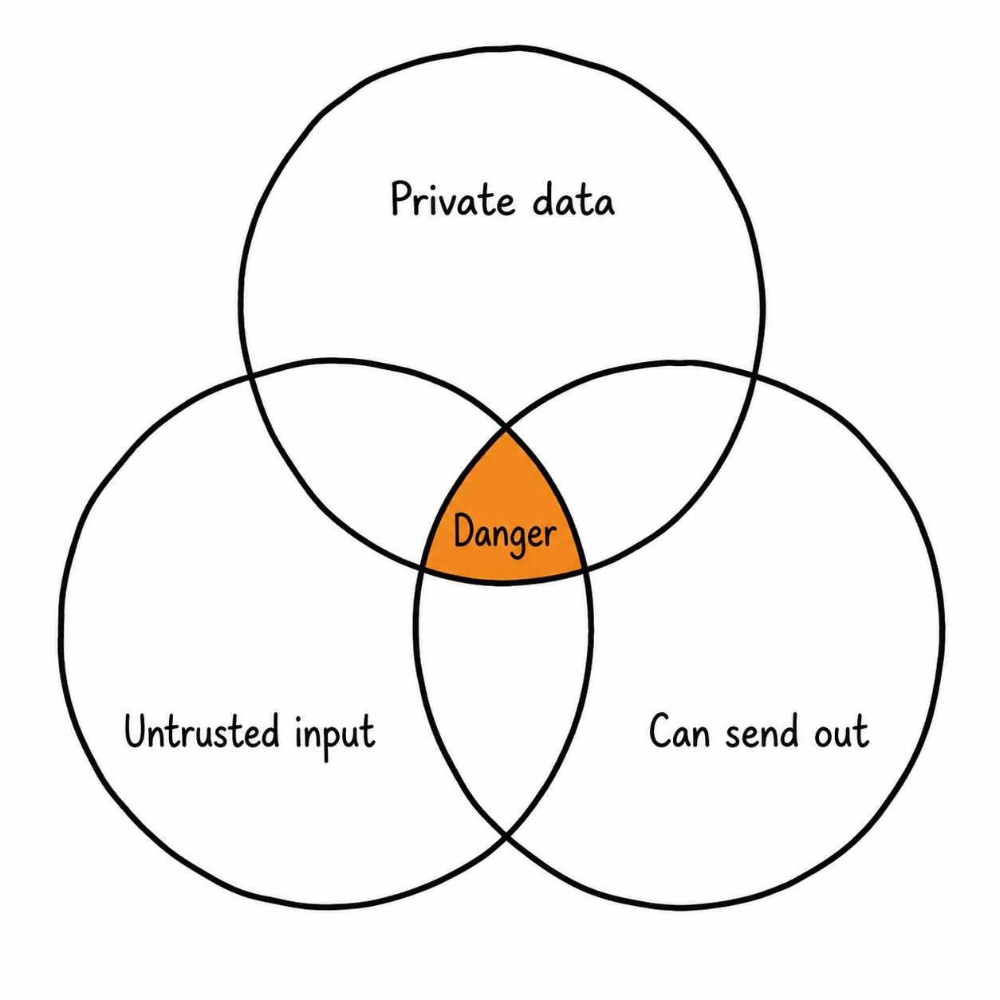

# Soft Skills for AI-Native Engineers

> The non-technical skills that decide whether your AI system survives contact with users, auditors, and your own team. [Back to root](README.md)

Model capability is table stakes and getting cheaper. What's scarce is judgment: knowing when to trust generated code, what a feature costs at scale, where the security boundary is, and how to tell a stakeholder that the system is 92% accurate and will stay that way. These five sections are the ones that show up in promotion conversations and incident reviews.

---

## 1. Reviewing AI-Generated Code

The volume of code produced per engineer has gone up sharply. The review capacity has not. That makes reviewing *well* — and reviewing differently than you would human code — a core skill rather than a chore.

**AI-generated code fails differently.** It's syntactically clean, idiomatic, well-commented, and confident. It rarely has the tells that trigger human suspicion. The failures cluster elsewhere: plausible-looking APIs that don't exist, silently dropped edge cases, error handling that catches and swallows, subtle off-by-one and boundary errors inside otherwise-correct logic, security shortcuts (string-interpolated SQL, disabled TLS verification, secrets inlined "for now"), unnecessary dependencies, and duplicated logic that already existed twenty lines away.

**Review priorities, in order:**

1. **Does it do what was asked?** Re-read the requirement, then the diff. Generated code frequently solves a nearby, easier problem.
2. **What happens on the unhappy path?** Empty input, null, timeout, partial failure, concurrent access.
3. **Security boundaries.** Input validation, authz checks, secrets, injection surfaces, dependency provenance.
4. **Does this belong here?** Fit with existing abstractions matters more than local elegance. Generated code doesn't know your codebase's conventions unless you told it.
5. **Then** style and structure — the cheapest thing to fix and the least important.

**Working rules**

- **You own the code you merge**, regardless of who typed it. "The model wrote it" is not a valid line in a postmortem.
- **Ask for the smaller diff.** Large generated changes are hard to review and easy to rubber-stamp. Constrain scope up front.
- **Verify every unfamiliar API and dependency.** Hallucinated package names are also a supply-chain attack vector (typosquatting on plausible-but-nonexistent names is a known technique).
- **Make it explain itself.** Asking "what happens if this list is empty?" surfaces bugs faster than reading line by line.
- **Never merge what you can't explain.** If you can't defend it in review, you can't debug it at 2 a.m.
- **Let tests and types do the mechanical work** so review attention goes to intent and edge cases.
- **Treat "looks right" as a red flag.** The output is optimized to look right.

**Checklist**
- [ ] I re-read the original requirement before reading the diff
- [ ] I traced at least two failure paths by hand
- [ ] I verified every new dependency and unfamiliar API actually exists
- [ ] I checked for injection, authz, and secret-handling issues
- [ ] I can explain every line I approved

---

## 2. Cost and Latency Tradeoffs

In conventional backend work, a request costs a rounding error. In AI systems it costs cents, and cents at scale are budgets. Engineers who can reason fluently about cost-per-request in a product conversation become the people who get to make architecture decisions.

**Build the arithmetic reflex.** Before proposing anything, estimate: tokens per request × price per token × requests per day. Do it out loud. "That summarization feature is ~3K input, ~600 output, ~$0.012 per call — at 50K calls a day that's $600/day, $18K/month." That sentence changes conversations. Ballpark early, measure later, but never ship without either.

**Know the levers and their rough magnitude** (details in [Module 06](06-deployment-and-ai-infra/README.md#63-cost-and-latency-engineering)):

| Lever | Typical effect | Cost |
|---|---|---|
| Route easy requests to a smaller model | 60–80% cost reduction | Engineering + eval work to prove parity |
| Prompt caching on a stable prefix | Up to ~90% off repeated input, better TTFT | Prompt restructuring discipline |
| Cap and shorten output | Large — output dominates cost *and* latency | May reduce answer quality |
| Batch API for async work | ~50% | Latency measured in hours |
| Retrieve less, retrieve better | Moderate cost, often *better* quality | Retrieval engineering ([Module 03](03-retrieval-and-rag/README.md)) |
| Self-host an open model | Wins only above sustained volume | Ops burden, GPU idle cost |

**Latency is a product decision, not just a metric.** Distinguish what the user actually feels: TTFT for streamed chat, total time for a background job. A 400 ms TTFT with streaming beats a 3 s wait for a complete answer, even though the second finished sooner in a benchmark. Quote p95, not the mean. And name the tradeoff explicitly rather than deciding it silently: *"We can cut p95 from 8s to 2s by switching models — accuracy drops from 94% to 89% on our eval set. Which do you want?"* That's the sentence senior engineers say and junior ones don't.

**Checklist**
- [ ] I can state cost per request and per month for every AI feature I own
- [ ] I quote p95, not mean latency
- [ ] I've tested whether a cheaper model passes our eval set
- [ ] Quality/cost/latency tradeoffs were presented as choices, not made silently
- [ ] There's a budget alert before there's a budget surprise

---

## 3. Prompt Injection and Security Awareness

The core fact: **LLMs cannot reliably distinguish instructions from data.** Any untrusted text that reaches the context window — a web page, a PDF, an email, a GitHub issue, a tool result, a filename — can carry instructions the model may follow. There is no prompt that fixes this. Mitigation is architectural.

**The lethal trifecta.** A system is exploitable when it combines all three of:

1. Access to **private data**
2. Exposure to **untrusted content**
3. An **outbound communication channel** (email, HTTP, webhook, writing to a shared surface)

  

Break any one leg and exfiltration stops being possible. Most real-world agent vulnerabilities are exactly this pattern — an injected instruction in a document tells the agent to encode private data into a URL and fetch it. Read [Simon Willison's series on prompt injection](https://simonwillison.net/series/prompt-injection/); it's the best continuously-updated source on the topic.

**Practices that actually help**

- **Least privilege per tool.** Read-only credentials where possible; scope by tenant; never hand an agent a superuser key.
- **Human approval on consequential actions** — sending, deleting, paying, publishing, pushing.
- **Allowlist outbound destinations.** No arbitrary URL fetching from an agent that has seen private data.
- **Treat generated code as untrusted.** Sandbox execution ([Module 04](04-agents-and-tool-use/README.md#44-environments-and-protocols-mcp-sandboxes-computer-use)).
- **Delimit and label untrusted content** clearly in the prompt. Helps at the margin; is not a control.
- **Enforce authorization outside the model.** Filter documents by permission *in the query*, never by asking the model to be discreet.
- **Log and monitor.** Full traces are how you detect and reconstruct an injection attempt.
- **Red-team your own system.** Plant injections in your test corpus as a standing test case.

Also watch: PII leaving your perimeter to third-party APIs (know retention and training terms), training-data extraction, insecure output handling (model output rendered as HTML → XSS), MCP server supply chain, and over-permissive tool catalogs.

- [OWASP Top 10 for LLM Applications](https://genai.owasp.org/llm-top-10/) · [NIST AI RMF](https://www.nist.gov/itl/ai-risk-management-framework)

**Checklist**
- [ ] I can name which leg of the lethal trifecta my system breaks
- [ ] Every tool runs with least-privilege credentials
- [ ] Consequential actions require human approval
- [ ] Outbound network destinations are allowlisted
- [ ] Authorization is enforced in the query, not by the model
- [ ] Injection attempts are in my test suite

---

## 4. Communicating AI System Limitations

Most AI project failures are expectation failures. The system works as built; someone believed it did something else. Handling this well is a career skill.

**Speak in distributions, not absolutes.** Not "it extracts invoice data" but "it extracts these five fields correctly 94% of the time on documents like our test set; it degrades on scanned faxes and multi-page tables." Every claim carries a scope and a number.

**Set expectations before launch, not after the incident.** Say plainly: what it's good at, the measured accuracy on a named eval set, the known failure modes, what happens when it fails, and what it should not be used for. Write it down. A one-page capability statement per AI feature prevents most downstream conflict.

**Translate for the audience.**

- **Executives** — cost, risk, and what it unblocks. "94% accurate, saves ~15 hours/week, needs human review on the 6%, ~$2K/month."
- **Product** — behaviour and edge cases. "It will occasionally return no answer rather than a wrong one. That's deliberate."
- **Users** — what to trust and how to verify. Show citations, show confidence, make correction easy.
- **Legal/compliance** — data flow, retention, provenance, human oversight, audit trail.

**Say "I don't know" precisely.** "I don't know how it behaves on Japanese documents — we have no eval data for that. Give me two days and 50 labeled examples and I'll tell you." That's a credible answer. Vague reassurance is not.

**Push back on the wrong problem.** Sometimes the honest answer is that an LLM is the wrong tool — a regex, a SQL query, a lookup table, or a form field would be more accurate, cheaper, and debuggable. Saying so early is far cheaper than saying it after a quarter of work.

**Never oversell nondeterminism away.** Stakeholders will assume software is deterministic because all their previous software was. State explicitly, once, in writing: the same input can produce different output, and here's how we bound that.

**Checklist**
- [ ] Every AI feature I own has a written capability statement with numbers
- [ ] Known failure modes are documented and communicated before launch
- [ ] Users can see sources / verify outputs
- [ ] Nondeterminism was stated explicitly to non-engineers
- [ ] I've told at least one stakeholder that AI was the wrong tool for something

---

## 5. Scoping, Judgment, and Working With Nondeterminism

The meta-skill under the other four: knowing what to build, and being comfortable shipping systems whose behaviour is a distribution.

- **Start from the failure cost.** A wrong answer in a draft email is cheap; a wrong answer in a medical dosage or a payment amount is not. Failure cost determines how much accuracy, review, and guardrail you need — decide it first.
- **Prototype in a day, evaluate for a week.** Feasibility is usually obvious quickly. Reliability is not. Budget accordingly, and resist the pull of a demo that works three times.
- **Design for graceful failure.** Abstention ("I don't have enough information") is a feature. So are citations, confidence signals, and easy correction paths. Systems that fail visibly beat systems that fail confidently.
- **Keep a human in the loop where it's cheap to do so** — and design that loop to be fast, not ceremonial.
- **Write for agents as well as humans.** Repo instruction files, clear tool descriptions, and precise specs are now engineering artifacts with direct leverage. Ambiguity you'd tolerate in a ticket becomes wrong code at scale.
- **Keep taste.** As generation gets cheaper, judgment about what's worth building — and what to delete — becomes the differentiating skill. Volume is free now; discernment isn't.

**Checklist**
- [ ] I decide the acceptable failure rate before building
- [ ] My systems can abstain instead of guessing
- [ ] Correction paths exist and are fast
- [ ] Repo instructions and tool descriptions are maintained like code
- [ ] I've killed at least one AI feature that wasn't worth it

---

[← Back to root](README.md) · [hot-topics.md](hot-topics.md) · [capstone.md](capstone.md)
